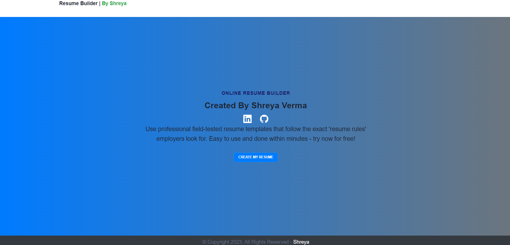

# CodeClauseInternship_Resume_Builder

Resume Builder Live Demo [link here](https://sanket-santoki.github.io/CodeClauseInternship_Resume_Builder/)

Github Profile [link](https://github.com/sanket-santoki/)

 

# Resume Builder
Build your professional resume with ease using this Resume Builder App. This application, developed with HTML, CSS, Bootstrap, and JavaScript, offers an intuitive interface for creating, customizing, and downloading resumes.

# Features
User-Friendly: Intuitive design for effortless resume creation.
Responsive: Ensures a consistent experience on various devices.
Bootstrap-Powered: Modern and sleek styling with Bootstrap.
Interactive: Dynamic customization with JavaScript.
Download: Easily download your formatted resume.

# Usage
Clone the repository.
Open index.html in your browser.
Fill in your details and customize sections.
Download your professional resume.

# Contribution
Feel free to contribute, report issues, or suggest improvements. Your input is valued!

# Technologies Used:
HTML
CSS
Bootstrap
JavaScript

# Credits:
Developed by Sanket Santoki
Internship at CodeClause

Thank you for checking out our Resume Builder Project. Stay informed, stay connected!
